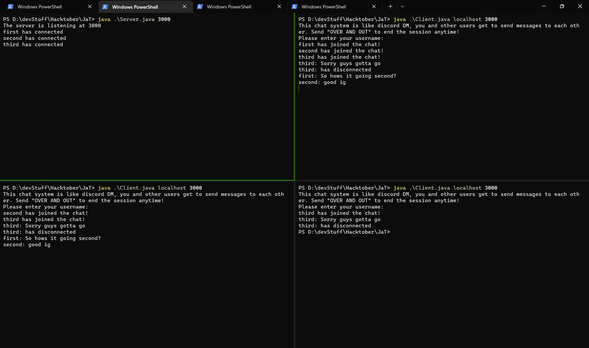
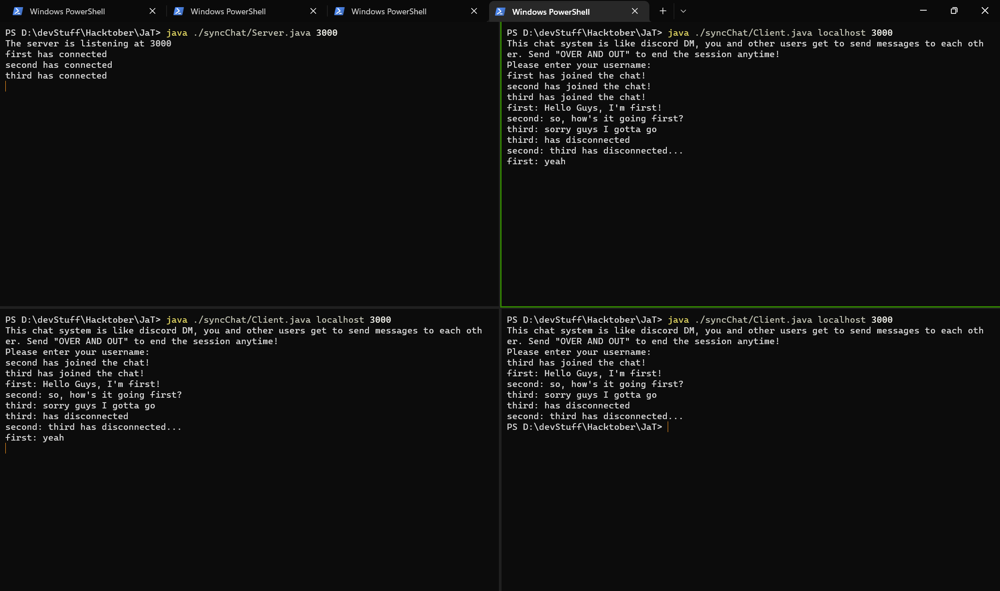

## Local Setup:

- After forking and cloning this repository to your local machine, open the project folder in your favourite code editor.

### Walkie Talkie System

- Open 2 terminal windows. In one, start the server by running `java Server.java`. In the other run the client by running `java Client.java`
- Chat from both the client and server side, by using the appropriate terminal windows



### Synchronized Chat

### Compile the classes

From the root of the project

```bash
javac -d <pathToStoreClassFiles> syncChat/Server.java
javac -d <pathToStoreClassFiles> syncChat/Client.java
```

### To run the server

From the root of the project

```bash
cd <pathToTheStoredClassFiles>
java syncChat.Server <portNumber>
```

### To join as a client

From the root of the project

```bash
cd <pathToTheStoredClassFiles>
java syncChat.Server <hostname> <portNumber>
```

Example:



## `utils` package

### `ColorPrinter`

Uses [ANSI escape sequences](https://en.wikipedia.org/wiki/ANSI_escape_code) for colored text in terminal

### Importing the class

```java
import utils.ColorPrinter;
```

`ColorPrinter` class contains many font colors and background colors as static properties. These properties are strings and can be used as follows:

### Basic Usage

```java
import utils.ColorPrinter;
...
System.out.println(ColorPrinter.RED + "This text is RED! " + ColorPrinter.BLUE + "This text is BLUE!" + ColorPrinter.RESET);
// Don't forget to use RESET after the string to reset the terminal to its original font colors
```

### `println` method

```java
public static String println(String x, String color); // returns string `x` in `color` color

public static void println(String x); // Prints onto the console - No colors - Terminal default

// Notice that we don't have to use RESET anymore, the method does that internally
System.out.println(ColorPrinter.println("This text is RED!", "RED")); // Red colored text with new line character in the end
```

### `printf` method

```java
public static String printf(String x);
// Usage

// Wrap the text to be colored in curly braces with $<colorName>{text}
System.out.println(ColorPrinter.printf("$YELLOW{This text is yellow!}, and $RED{this is RED!}"));

// Escape the `}` character using `\`
System.out.println(ColorPrinter.printf("$YELLOW{This text is yellow and it contains {\\} - curly braces!}"));
// Output: `This text is yellow and it contains {} - curly braces!` in yellow.


public static String printf(String x, String... args);
// Like the traditional println method in System.out
// Usage
System.out.println(ColorPrinter.printf("${This text is yellow}, ${this is cyan}"), "YELLOW", "CYAN");
```

### Colors provided

You can see the colors from the class [here](utils/ColorPrinter.java)

### Things to look out for

- All methods except `println(String x)` _return_ a string.

## Looking to help?

See the issues tab for specific areas where help would be appreciated. However, new issues for feature requests, refactoring ideas, bug reports, etc are most welcome!

Working on any issues that would help increase the customizability and usability of this project will be greatly appreciated.
