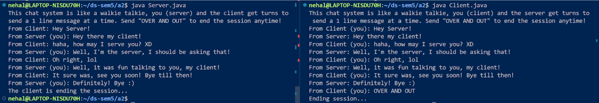

## Local Setup:

- After forking and cloning this repository to your local machine, open the project folder in your favourite code editor.

### To run the server

```bash
java ./Server.java portNumber
```

### To join as a client

```bash
java ./Client.java hostname portNumber
```

Example:



## Looking to help?

See the issues tab for specific areas where help would be appreciated. However, new issues for feature requests, refactoring ideas, bug reports, etc are most welcome!

Working on any issues that would help increase the customizability and usability of this project will be greatly appreciated.
